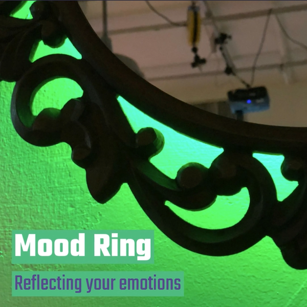

# Mood Ring

⬆️Click for Video⬆️

### Mood Ring is an interactive mirror that illuminates based on your mood.

See [my blog](http://www.blog.calebfergie.com/2018/12/04/mood-ring/) for more information.

#### Created using:
1. An express app with the EJS view
2. The facial recognition program within the [clmtracker library made by auduno](https://github.com/auduno/clmtrackr)
3. An arduino with the neopixel library, connected to the express app through serial communication (node & serial)

#### More info

Most of the customized code in this project can be found int the arduino folder and the `mood-ring.ejs` file in the `views` folder

How to use this code:
1. Clone or download this repository
2. Open the project folder in your command line tool and run npm install
3. Upload the code in the 'Arduino code' folder to your arduino
4. Start serving the express app by using `node bin/www` (or alternatively `nodemon bin/www` for automatic reloading)
5. Open a browser and navigate to `localhost:3000`
6. Press the 'start' button to start tracking and sending values to the arduino

Not working? Changes you may need to make:
1. Number of pixels, pin of LED strip (arduino code)
2. Name of USB port of arduino (index.js)
3. Thresholds of emotion recognition (mood-ring.ejs)